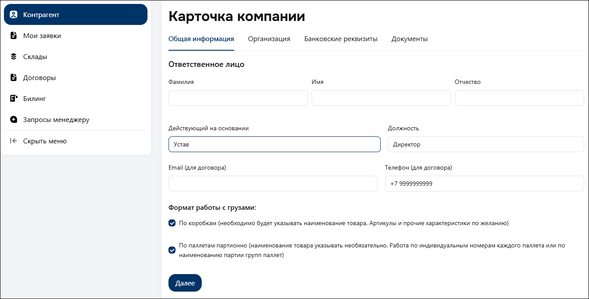
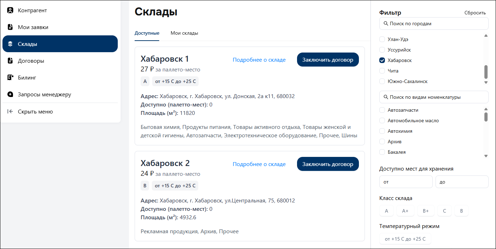
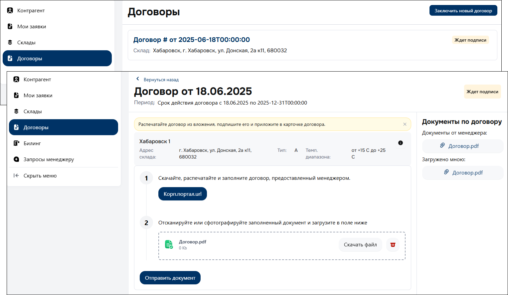
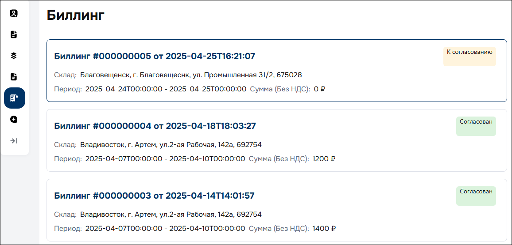

# Начало работы

1. Заполните реквизиты карточки компании.
2. Выберите склад и заключите договор.
3. Создайте первую [заявку:material-open-in-new:](warehouse-request.md) на хранение продукции.
4. Отслеживайте биллинг по взаимодействию со складом по итогам установленного периода.

=== "Карточка компании"

    1. Перейдите в раздел «*Контрагент*», используя навигационную панель в личном кабинете *AP Logistics*.
    2. Поочередно заполните реквизиты разделов «*Общая информация*», «*Организация*», «*Банковские реквизиты*», «*Документы*».

        !!! warning ""

            :material-alert-circle-outline: **ОБРАТИТЕ ВНИМАНИЕ**  
            *Необходимо определить формат работы с грузами* – это повлияет на их последующую обработку.  
            *По коробкам* – для коробочного учета продукции.  
            *По паллетам*, *партионно* – для паллетного учета продукции.

    3. Нажмите кнопку «*Сохранить*».

    <figure markdown="span">
        { width="400" }
        <figcaption><small>Карточка компании</small></figcaption>
    </figure>

=== "Склад"

    1. Перейдите в раздел «*Склады*».
    2. Выберите требуемый склад для заключения договора.  
    Панель «*Фильтр*» поможет настроить отбор складов по вашему запросу.
    3. Нажмите кнопку «*Заключить договор*».

    <figure markdown="span">
        { width="400" }
        <figcaption><small>Договор со складом</small></figcaption>
    </figure>

    !!! success ""

        Предварительный договор отобразится в разделе «*Договоры*» в статусе «*На обработке*».  
        Ожидайте изменение текущего статуса на «*Ждет подписи*».

=== "Договор"

    1. Перейдите в раздел «*Договоры*».
    2. Откройте карточку договора в статусе «*Ждет подписи*».
    3. Скачайте, распечатайте и заполните договор, предоставленный менеджером.
    4. Отсканируйте или сфотографируйте заполненный документ и загрузите его в соответствующее поле.
    5. Нажмите кнопку «*Отправить документ*».

    <figure markdown="span">
        { width="400" }
        <figcaption><small>Договор со складом</small></figcaption>
    </figure>

    !!! success ""

        После отправки подписанного договора, ожидайте изменение его статуса на «*Действует*».

=== "Биллинг"

    По окончанию установленного периода, в разделе «*Биллинг*» будет отображена информация по всем предоставленным услугам за требуемый период.

    !!! note ""

        В рамках взаимодействия со складом, вам необходимо **согласовать** либо **опровергнуть** предоставленный биллинг.

    !!! warning ""

        В случае **несогласия** c биллингом, вопрос будет решен в индивидуальном порядке. 

    <figure markdown="span">
        { width="400" }
        <figcaption><small>Биллинг</small></figcaption>
    </figure>
