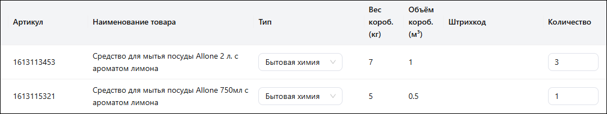
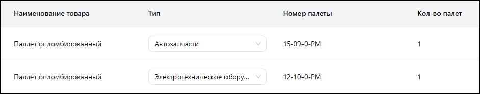
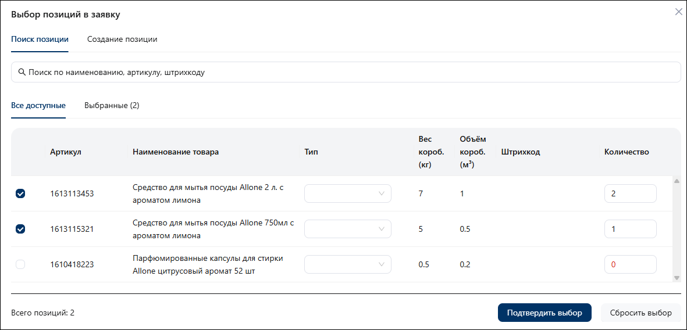
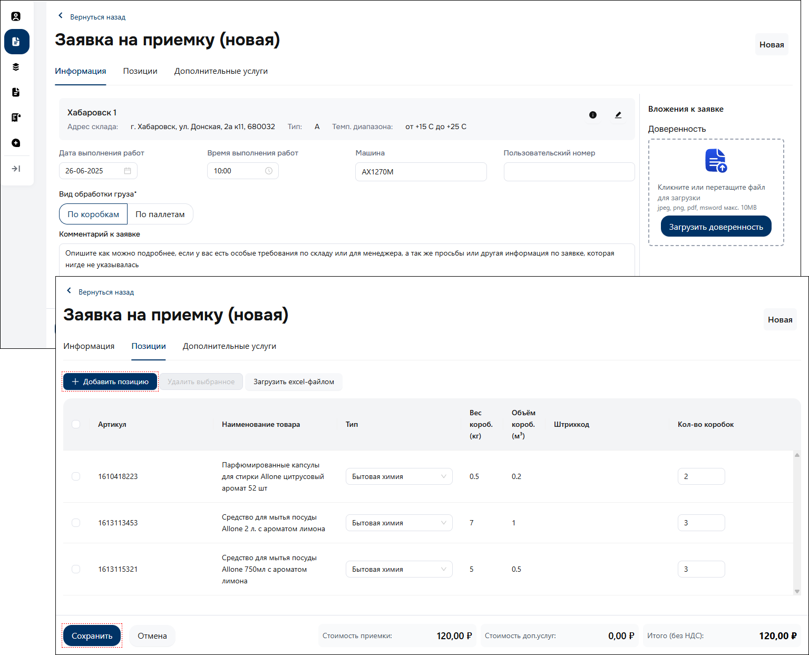
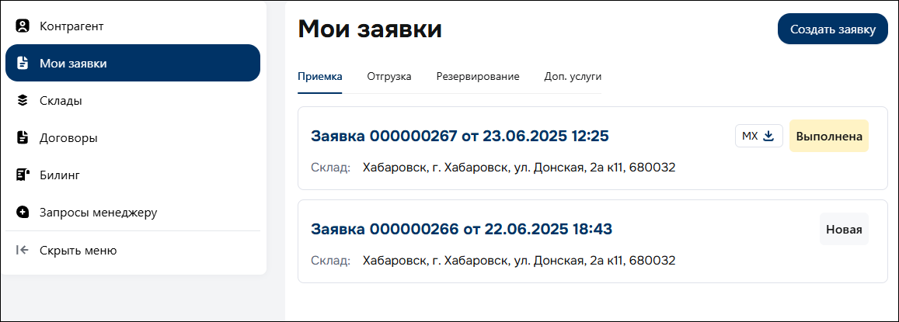
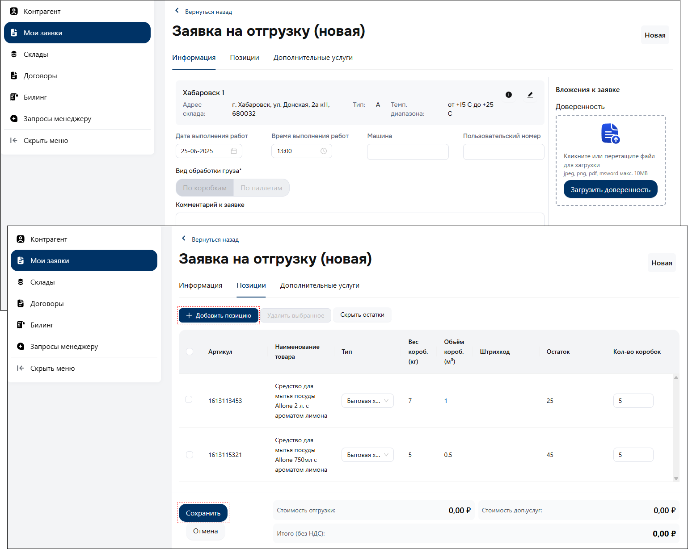
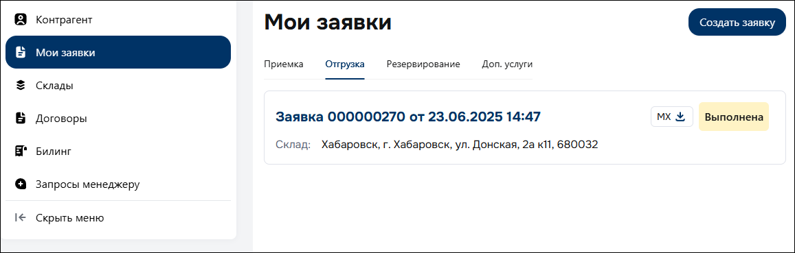
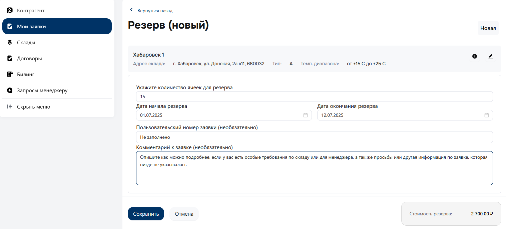
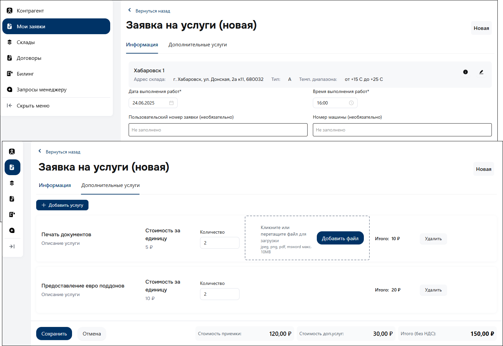

# Заявка на склад

Для взаимодействия со складом, вы можете направить следующие заявки:

- **Приемка** – приемка продукции на склад для хранения.
- **Отгрузка** – отгрузка продукции со склада в соответствии с вашим запросом.
- **Резервирование** – резервирование ячеек склада на требуемый период.
- **Дополнительные услуги** – печать документов, предоставление европоддонов, стрейчевание паллет.

=== "Приемка"

    1. Перейдите в раздел «*Мои заявки*» :material-arrow-right-thin: *Приемка*.
    2. Нажмите кнопку «*Создать заявку*».
    3. Заполните обязательные реквизиты на вкладке «*Информация*»:
    
        - *Дата* и *Время* выполнения работ.
        - Вид обработки груза (коробками / паллетами).
        
        !!! warning ""

            :material-alert-circle-outline: **ОБРАТИТЕ ВНИМАНИЕ**  
            Дальнейшая обработка, например *отгрузка принятой продукции*, будет осуществляться в соответствии с форматом, указанным при оформлении заявки на приемку – только коробками либо паллетами.

        `При необходимости, вы можете загрузить отсканированную Доверенность.`
        
        ### **Приемка коробками**
        При коробочной обработке груза, вы формируете номенклатуру продукции в разрезе коробок.

        <figure markdown="span">
            
            <figcaption><small>Приемка коробками</small></figcaption>
        </figure>

        ### **Приемка паллетами**

        Паллетная обработка груза предполагает разделение на форматы.

        - **Паллетно-партионный** – в рамках одной партии может быть указано несколько паллет.

        <figure markdown="span">
            
            <figcaption><small>Паллетно-партионный учет</small></figcaption>
        </figure>

        - **Паллетно-экземплярный** – каждая паллета будет иметь уникальный номер.

        <figure markdown="span">
            
            <figcaption><small>Индивидуальные паллеты</small></figcaption>
        </figure>
        
    4. Добавьте в заявку требуемые позиции на вкладке «*Позиции*».  
    Добавление номенклатуры при *приемке коробками*, возможно вручную либо через загрузку общего списка в *Excel*-файле.

        !!! warning ""

            :material-alert-circle-outline: **ОБРАТИТЕ ВНИМАНИЕ**  
            Если в текущей заявке имеются позиции, в рамках коробочной обработки груза, **добавленные ранее** – повторно создавать такие позиции **не требуется**, достаточно их выбрать из предложенного списка.
        
        <figure markdown="span">
            { width="400" }
        </figure>

        !!! note ""

            Расчет стоимости приемки производится в зависимости от выбранного Вида обработки груза и количества заявленных позиций / паллет, а также наличия дополнительных услуг.

    5. Нажмите кнопку «*Сохранить*».

        <figure markdown="span">
            { width="400" }
            <figcaption><small>Заявка на приемку</small></figcaption>
        </figure>

        !!! success ""
        
            После отправки заявки, ожидайте изменение ее статуса на «*Выполнена*».  
            К выгрузке будет доступна *унифицированная форма № МХ-1* (Акт о приеме-передаче товарно-материальных ценностей на хранение).

        !!! warning ""
        
            В случае расхождений по количеству принятых позиций / паллет, к выгрузке будет доступна *унифицированная форма № ТОРГ-2* (Акт об установленном расхождении по количеству и качеству при приемке товарно-материальных ценностей).
        
        <figure markdown="span">
            { width="400" }
            <figcaption><small>Заявка на приемку</small></figcaption>
        </figure>

=== "Отгрузка"

    1. Перейдите в раздел «*Мои заявки*» :material-arrow-right-thin: *Отгрузка*.
    2. Нажмите кнопку «*Создать заявку*».
    3. Заполните обязательные реквизиты на вкладке «*Информация*»: *Дата* и *Время* выполнения работ.

        `При необходимости, вы можете загрузить отсканированную Доверенность.`
        

    4. Выберете на вкладке «*Позиции*» требуемые позиции / паллеты, их количество из доступного остатка для отгрузки со склада.

        !!! note ""

            Расчет стоимости отгрузки производится в зависимости от выбранного Вида обработки груза и количества требуемых позиций / паллет, а также наличия дополнительных услуг.

    5. Нажмите кнопку «*Сохранить*».

        <figure markdown="span">
            { width="400" }
            <figcaption><small>Заявка на отгрузку</small></figcaption>
        </figure>

        !!! success ""

            После отправки заявки, ожидайте изменение ее статуса на «*Выполнена*».  
            К выгрузке будет доступна *унифицированная форма № МХ-3* (Акт о приеме-передаче товарно-материальных ценностей на хранение).
        
        <figure markdown="span">
            { width="400" }
            <figcaption><small>Заявка на отгрузку</small></figcaption>
        </figure>

=== "Резервирование"

    1. Перейдите в раздел «*Мои заявки*» :material-arrow-right-thin: *Резервирование*.
    2. Нажмите кнопку «*Создать заявку*».
    3. Заполните обязательные реквизиты:

        - Количество ячеек для резерва.
        - Период резервирования.

        !!! note ""
        
            Расчет стоимости услуги производится в зависимости от количества требуемых ячеек и периода резервирования.

    4. Нажмите кнопку «*Сохранить*».

        <figure markdown="span">
            { width="400" }
            <figcaption><small>Заявка на резервирование</small></figcaption>
        </figure>

        !!! success ""

            После отправки заявки, ожидайте изменение ее статуса на «*Выполнена*».  
            Резерв будет активен в установленный период.

=== "Дополнительные услуги"

    1. Перейдите в раздел «*Мои заявки*» :material-arrow-right-thin: *Дополнительные услуги*.
    2. Нажмите кнопку «*Создать заявку*».
    3. Заполните обязательные реквизиты:

        - На вкладке «*Информация*» – укажите *Дату* и *Время* выполнения работ.
        - На вкладке «*Дополнительные услуги*» – выберете требуемые услуги и их количество.

        !!! note ""
        
            Расчет общей стоимости дополнительных услуг производится в зависимости от их вида и количества.

    4. Нажмите кнопку «*Сохранить*».

        <figure markdown="span">
            { width="400" }
            <figcaption><small>Дополнительные услуги</small></figcaption>
        </figure>

        !!! success ""

            После отправки заявки, ожидайте изменение ее статуса на «*Выполнена*».

    !!! note ""
    
        Дополнительные услуги возможно оформить аналогичным способом, в рамках *новой заявки* на приемку / отгрузку продукции, на вкладке «*Дополнительные услуги*».
